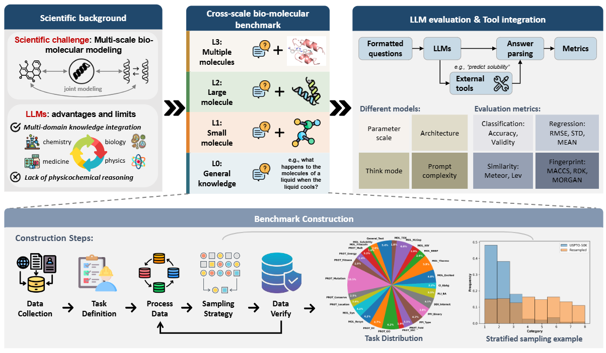

# CSB-Bench: A Cross-Scale Biomolecular Benchmark for Large Language Models

## 📊 Overview

BioMol-LLM-Bench is a standardized benchmark designed to evaluate large language models (LLMs) and agentic systems across the **multi-scale hierarchy of biomolecular problems**, from small molecules to protein complexes. The benchmark integrates diverse task types, including **classification, regression, and generation**, with optional **tool-augmented workflows**, enabling systematic and reproducible assessment of model capabilities.



This repository provides the full benchmark dataset, evaluation pipeline, and analysis scripts required to reproduce all reported results.

---

## 📂 Data Description

The benchmark dataset is located in the `dataset/` directory and includes:

* `all_prompts.json`: unified prompt set for general LLMs
* `all_prompts_naturelm.json`: unified prompt set for NatureLM
* `all_prompts_txgemma.json`: unified prompt set for TxGemma-Chat-9B
* `ans_all_prompts.json`: keys for reference answers
* `tool_all_prompts.json`: tool usage specifications
* `keys_all_prompts.json`: keys for input data
* `path_all_prompts.json`: data path for each task

Subdirectories:

* `general/`: general domain tasks
* `prediction/`: bio-molecular domain tasks

All code required to reproduce the evaluation is included in this repository.

```
.
├── integrate.py            % aggregates results into unified tables
├── metrics.py              % defines evaluation metrics
├── run_evaluation.py       % generates model predictions
├── run_judgement.py        % automatic answer extraction
├── templates.py
├── traverse.py
└── utils.py
```

Example outputs for selected models are saved in `demo_parse/`, `demo_result/` and `final_results`.

---

## 🚀 Geting Started

### 1. Repository download

```bash
git clone https://github.com/AI-HPC-Research-Team/BioMol-LLM-Bench.git
cd BioMol-LLM-Bench
```


### 2. Environment setup

```bash
conda env create -f environment.yml
conda activate bench
```


### 3. NLTK resource

Download required linguistic resources in advance, this step is optional.

```python
import nltk
nltk.download('punkt', download_dir='./nltk_data')
nltk.download('wordnet', download_dir='./nltk_data')
nltk.download('punkt_tab', download_dir='./nltk_data')
```

### 4. API configuration

Model API keys must be specified prior to evaluation.

Set environment variables:

```bash
export OPEN_ROUTER_KEY=YOUR_KEY
export DEEPSEEK_API_KEY=YOUR_KEY
```

Alternatively, keys can be configured directly in:

* `run_evaluation.py`


### 5. Model evaluation

To generate predictions across all tasks:

```bash
# through api
python run_evaluation.py -api -platform openrouter -simplify -model openai/gpt-4.1-mini -result_dir demo_result
python run_evaluation.py -api -platform deepseek -simplify -model deepseek-chat -result_dir demo_result -tool   # enable tool calling

# load local model from ./ckpt folder
python run_evaluation.py -ckpt ./ckpt -model txgemma-9b-chat -result_dir demo_result
```

Outputs are saved to `demo_result`.


### 6. Automated judgement

To compute evaluation metrics:

```bash
# run judgement for single experiment
python run_judgement.py -root_path demo_result -model deepseek-chat -time 2026-03-18_09_56_35 -log_path demo_parse -tool

# traverse the whole demo_result directory and generate results for all experiments
python traverse.py -root_path demo_result -log_path demo_parse
```

Intermediate and per-task results are written to `demo_parse`.


### 7. Result integration

To aggregate all results into final benchmark tables:

```bash
python integrate.py -log_path demo_parse -final_path final_results
```

Final outputs are stored in `final_results`.

---

## 📖 Citation

If you use CSB-Bench in your research, please cite:

```bibtex
@article{csb_bench_2026,
  title   = {BioMol-LLM-Bench},
  author  = {xxx},
  journal = {arXiv preprint arXiv:XXXX.XXXXX},
  year    = {2026}
}
```

---

## 🤝 Contributing

We welcome contributions!

* Add new tasks or datasets under `dataset/`
* Extend evaluation metrics in `metrics.py`

Please open an issue or submit a pull request.

---

## 📬 Acknowledgements

We acknowledge the developers of open-source libraries and model providers that made this benchmark possible.

---


